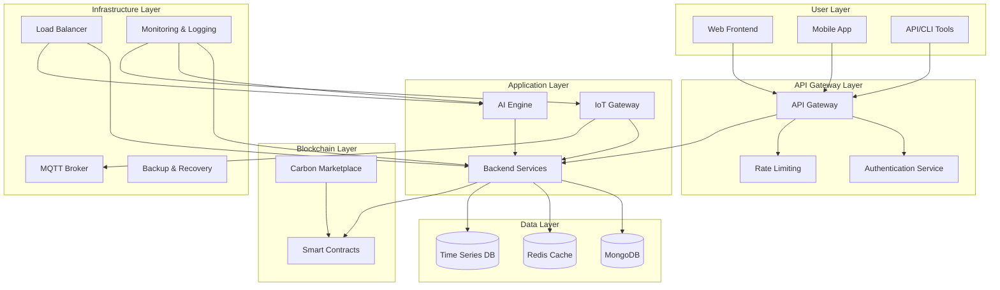
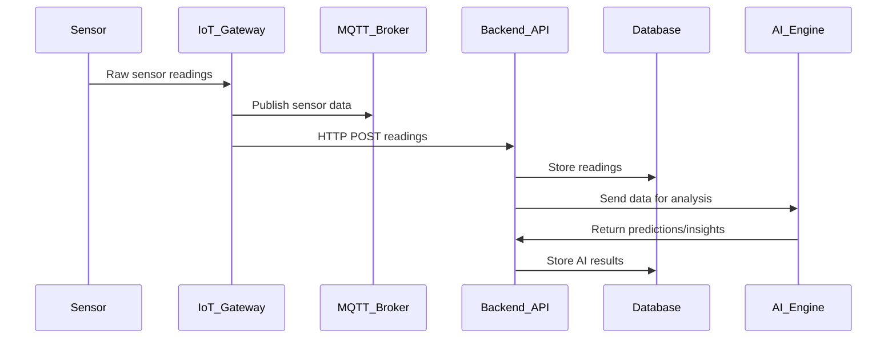
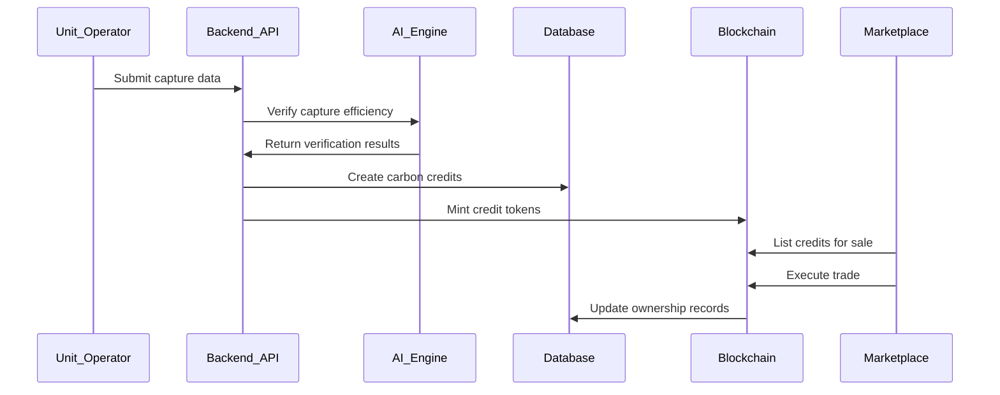

# Carbon Capture Network - System Architecture

## Overview

The Carbon Capture Network is a comprehensive AI-powered platform for managing carbon capture and storage operations. This document describes the system architecture, components, and their interactions.

## Architecture Overview

## Core Components

### 1. Frontend Layer

#### Web Frontend (Next.js)
- **Purpose**: User interface for system management and monitoring
- **Technologies**: Next.js, React, TypeScript, Tailwind CSS
- **Features**:
  - Dashboard with real-time metrics
  - Unit management interface
  - Sensor data visualization
  - Carbon credit marketplace
  - User management
  - Reporting and analytics

#### Mobile Application
- **Purpose**: Mobile access for field operators and managers
- **Technologies**: React Native, Redux
- **Features**:
  - Real-time alerts and notifications
  - Sensor readings and status
  - Maintenance scheduling
  - Offline data collection

### 2. API Gateway Layer

#### API Gateway
- **Purpose**: Centralized entry point for all API requests
- **Technologies**: Express.js with custom middleware
- **Features**:
  - Request routing and load balancing
  - Authentication and authorization
  - Rate limiting and throttling
  - Request/response transformation
  - API versioning
  - Request logging and monitoring

#### Authentication Service
- **Purpose**: User authentication and authorization
- **Technologies**: JWT, bcrypt, Redis sessions
- **Features**:
  - Multi-factor authentication
  - Role-based access control (RBAC)
  - API key management
  - Session management
  - Password policies and security

### 3. Application Layer

#### Backend Services (Node.js/Express)
- **Purpose**: Core business logic and API endpoints
- **Technologies**: Node.js, Express.js, MongoDB, Redis
- **Components**:
  - **User Management**: User registration, profiles, permissions
  - **Unit Management**: Carbon capture unit CRUD operations
  - **Sensor Management**: Sensor configuration and monitoring
  - **Credit Management**: Carbon credit issuance, trading, retirement
  - **Reporting**: Performance reports, analytics, compliance
  - **Notification System**: Email, SMS, push notifications

#### AI Engine (Python/FastAPI)
- **Purpose**: Machine learning models and AI optimization
- **Technologies**: Python, FastAPI, scikit-learn, TensorFlow
- **Models**:
  - **Efficiency Prediction**: Predict capture efficiency
  - **Maintenance Prediction**: Predictive maintenance alerts
  - **Energy Optimization**: Optimize energy consumption
  - **Anomaly Detection**: Detect sensor anomalies
  - **Process Optimization**: Real-time process parameter optimization

#### IoT Gateway
- **Purpose**: IoT device management and data collection
- **Technologies**: Python, MQTT, asyncio
- **Features**:
  - Sensor data collection and buffering
  - Device management and configuration
  - Real-time data streaming
  - Protocol translation (MQTT, Modbus, etc.)
  - Edge computing capabilities

### 4. Data Layer

#### MongoDB (Primary Database)
- **Purpose**: Main application data storage
- **Collections**:
  - `users`: User accounts and profiles
  - `units`: Carbon capture units
  - `sensors`: Sensor configurations and metadata
  - `credits`: Carbon credit records
  - `transactions`: Credit transfer history
  - `alerts`: System alerts and notifications
  - `reports`: Generated reports and analytics

#### Redis (Cache & Sessions)
- **Purpose**: High-performance caching and session storage
- **Uses**:
  - Session storage
  - API response caching
  - Real-time data buffering
  - Rate limiting data
  - Background job queues

#### Time Series Database
- **Purpose**: Sensor readings and time-series data
- **Features**:
  - High ingestion rates
  - Efficient time-range queries
  - Data aggregation and downsampling
  - Retention policies

### 5. Blockchain Layer

#### Smart Contracts (Solidity)
- **Purpose**: Immutable carbon credit records and marketplace
- **Contracts**:
  - **CarbonCredit.sol**: Credit issuance, transfer, retirement
  - **CarbonCreditMarketplace.sol**: Decentralized marketplace
  - **Oracle.sol**: External data verification

#### Carbon Marketplace
- **Purpose**: Decentralized trading platform
- **Features**:
  - Credit listing and bidding
  - Automated settlement
  - Price discovery
  - Compliance verification

### 6. Infrastructure Layer

#### MQTT Broker (Mosquitto)
- **Purpose**: IoT device communication
- **Features**:
  - Device-to-cloud messaging
  - Topic-based routing
  - QoS levels (0, 1, 2)
  - Retained messages
  - Last will and testament

#### Monitoring & Logging
- **Purpose**: System observability and troubleshooting
- **Tools**: ELK Stack (Elasticsearch, Logstash, Kibana), Prometheus, Grafana
- **Metrics**:
  - System performance
  - API response times
  - Error rates
  - Resource utilization
  - Business metrics

## Data Flow Architecture

### Sensor Data Flow

### Carbon Credit Flow

## Security Architecture

### Authentication & Authorization
- **JWT Tokens**: Stateless authentication
- **Role-Based Access Control**: Granular permissions
- **API Keys**: Service-to-service authentication
- **Multi-Factor Authentication**: Enhanced security for sensitive operations

### Data Security
- **Encryption**: TLS 1.3 for data in transit
- **Database Encryption**: Encrypted sensitive data at rest
- **API Security**: Input validation, SQL injection prevention
- **Blockchain Security**: Cryptographic verification of transactions

### Network Security
- **Firewall**: Network segmentation and access control
- **DDoS Protection**: Rate limiting and traffic filtering
- **Intrusion Detection**: Real-time threat monitoring
- **VPN**: Secure remote access

## Scalability Considerations

### Horizontal Scaling
- **Load Balancing**: Distribute traffic across multiple instances
- **Database Sharding**: Distribute data across multiple servers
- **Microservices**: Independent scaling of components
- **CDN**: Static asset delivery optimization

### Performance Optimization
- **Caching Strategy**: Multi-layer caching (CDN, Redis, application)
- **Database Indexing**: Optimized queries and aggregations
- **Async Processing**: Background job processing for heavy operations
- **Data Partitioning**: Time-based and geographical partitioning

### High Availability
- **Redundancy**: Multiple instances across availability zones
- **Failover**: Automatic failover mechanisms
- **Backup**: Regular data backups with disaster recovery
- **Monitoring**: Comprehensive health monitoring and alerting

## Deployment Architecture

### Development Environment
- **Local Development**: Docker Compose for local development
- **CI/CD Pipeline**: Automated testing and deployment
- **Feature Branches**: Isolated development environments

### Production Environment
- **Container Orchestration**: Kubernetes for production deployment
- **Service Mesh**: Istio for service-to-service communication
- **Infrastructure as Code**: Terraform for infrastructure provisioning
- **Configuration Management**: Environment-specific configurations

### Cloud Architecture
- **Multi-Cloud**: AWS, GCP, Azure support
- **Serverless**: Lambda functions for event processing
- **Edge Computing**: CloudFront for global distribution
- **Hybrid Cloud**: On-premises and cloud integration

## Monitoring and Observability

### Application Monitoring
- **APM**: Application Performance Monitoring
- **Error Tracking**: Sentry for error reporting
- **Log Aggregation**: Centralized logging with ELK
- **Metrics Collection**: Prometheus metrics

### Infrastructure Monitoring
- **Resource Monitoring**: CPU, memory, disk usage
- **Network Monitoring**: Traffic, latency, errors
- **Container Monitoring**: Kubernetes metrics
- **Database Monitoring**: Query performance, connections

### Business Monitoring
- **KPI Tracking**: Key performance indicators
- **User Analytics**: User behavior and engagement
- **Carbon Metrics**: Capture efficiency, credit issuance
- **Financial Metrics**: Revenue, costs, ROI

## Disaster Recovery

### Backup Strategy
- **Database Backups**: Daily full backups, hourly incremental
- **File Backups**: Configuration and static files
- **Blockchain Backups**: Distributed ledger replication
- **Cross-Region Replication**: Multi-region data replication

### Recovery Procedures
- **RTO/RPO**: Defined recovery time and point objectives
- **Failover Plans**: Automated and manual failover procedures
- **Data Recovery**: Point-in-time recovery capabilities
- **Business Continuity**: Alternate site operations

## Future Considerations

### Scalability Enhancements
- **Event Sourcing**: Event-driven architecture for complex operations
- **CQRS**: Command Query Responsibility Segregation for performance
- **Graph Database**: Relationship modeling for complex queries
- **AI/ML Pipeline**: Advanced machine learning capabilities

### Emerging Technologies
- **Edge AI**: AI processing at the network edge
- **5G Integration**: High-speed IoT connectivity
- **Quantum Computing**: Advanced optimization algorithms
- **Web3 Integration**: Decentralized identity and governance

This architecture provides a robust, scalable, and secure foundation for the Carbon Capture Network while allowing for future growth and technological advancements.