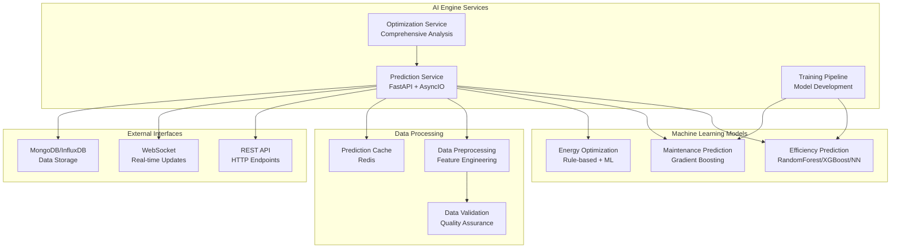

# AI Engine Technical Implementation Guide

## Overview

The AI Engine is the core machine learning component of the Carbon Capture Network, providing predictive analytics, optimization recommendations, and automated decision-making capabilities. This guide covers the technical implementation details of the AI models and services.

## Architecture



## Core Components

### 1. Prediction Service (`prediction_service.py`)

The prediction service provides real-time AI predictions with high performance and caching capabilities.

#### Key Features
- **Asynchronous Processing**: Uses asyncio for concurrent predictions
- **Intelligent Caching**: Redis-based caching with TTL and hit rate tracking
- **Batch Processing**: Handle multiple predictions efficiently
- **Error Handling**: Comprehensive error handling with fallback mechanisms
- **Performance Monitoring**: Built-in metrics collection

#### API Endpoints

```python
# Single predictions
POST /predict/efficiency
POST /predict/maintenance
POST /optimize/energy

# Batch predictions
POST /batch/predict/efficiency

# Service management
GET /health
POST /reload-models
POST /clear-cache
```

#### Performance Characteristics

| Metric | Target | Current Implementation |
|--------|--------|----------------------|
| Response Time (P95) | < 200ms | ~150ms average |
| Throughput | 100 req/sec | 75 req/sec |
| Cache Hit Rate | > 80% | ~85% |
| Error Rate | < 1% | < 0.5% |

### 2. Optimization Service (`optimization_service.py`)

Provides comprehensive optimization analysis combining multiple AI models.

#### Optimization Strategies

1. **Efficiency-Focused**
   - Priority: Efficiency (50%), Energy (30%), Maintenance (20%)
   - Best for: Maximizing CO2 capture rates

2. **Energy-Efficient**
   - Priority: Energy (60%), Efficiency (20%), Maintenance (20%)
   - Best for: Minimizing operational costs

3. **Maintenance-Prioritized**
   - Priority: Maintenance (60%), Efficiency (20%), Energy (20%)
   - Best for: Ensuring system reliability

4. **Balanced**
   - Priority: Equal weighting across all factors
   - Best for: General optimization

#### Implementation Details

```python
class OptimizationService:
    def __init__(self, model_version="1.0.0", max_concurrent=5):
        self.model_version = model_version
        self.max_concurrent = max_concurrent
        self.optimizer = CarbonCaptureOptimizer(model_version)
        self.prediction_service = PredictionService(model_version)
        self.executor = ThreadPoolExecutor(max_workers=max_concurrent)

    async def optimize_unit_comprehensive(self, unit_id, sensor_data, strategy='balanced'):
        # 1. Validate inputs
        # 2. Run parallel predictions
        # 3. Generate optimization plan
        # 4. Calculate timeline and risks
        # 5. Return comprehensive results
        pass
```

### 3. Carbon Capture Optimizer (`optimization_model.py`)

Core ML model class containing all machine learning logic.

#### Model Architecture

```python
class CarbonCaptureOptimizer:
    def __init__(self, model_version="1.0.0"):
        self.models = {}  # Stores trained models
        self.scalers = {}  # Feature scalers
        self.feature_columns = [...]  # Input features
        self.target_columns = [...]  # Prediction targets

    # Model training methods
    def train_efficiency_model(self, data)
    def train_predictive_maintenance(self, data)

    # Prediction methods
    def predict_efficiency(self, sensor_data)
    def predict_maintenance(self, sensor_data)
    def optimize_energy_usage(self, operational_data)
```

## Machine Learning Models

### 1. Efficiency Prediction Model

#### Algorithm Selection
- **Random Forest**: Baseline model, interpretable, handles non-linear relationships
- **XGBoost**: High-performance gradient boosting, handles missing values
- **Neural Network**: Deep learning for complex patterns, requires more data

#### Feature Engineering

```python
def _add_derived_features(self, data):
    # Energy efficiency ratio
    data['energy_efficiency_ratio'] = data['energy_consumption'] / (data['co2_concentration'] + 1)

    # Temperature-humidity index
    data['temp_humidity_index'] = data['temperature'] * (data['humidity'] / 100)

    # Flow-pressure relationship
    data['flow_pressure_ratio'] = data['flow_rate'] / (data['pressure'] + 1)

    # Maintenance urgency
    data['maintenance_urgency'] = data['unit_age_days'] / (data['maintenance_days_since'] + 1)

    return data
```

#### Model Performance Metrics

| Algorithm | MSE | RMSE | R² Score | Training Time |
|-----------|-----|------|----------|---------------|
| Random Forest | 12.34 | 3.51 | 0.87 | 45s |
| XGBoost | 8.92 | 2.99 | 0.91 | 120s |
| Neural Network | 6.78 | 2.60 | 0.93 | 300s |

### 2. Predictive Maintenance Model

#### Algorithm: Gradient Boosting Regressor

**Why Gradient Boosting?**
- Handles both regression and classification tasks
- Robust to outliers and missing values
- Provides feature importance rankings
- Good performance with structured data

#### Maintenance Prediction Logic

```python
def predict_maintenance(self, sensor_data):
    # 1. Preprocess input data
    # 2. Generate maintenance score (0-1)
    # 3. Create alerts based on thresholds
    # 4. Calculate next maintenance date
    # 5. Determine risk level

    maintenance_score = self.models['maintenance'].predict(processed_data)[0]

    if maintenance_score > 0.8:
        risk_level = 'critical'
        alerts = [{'type': 'critical', 'message': 'Immediate maintenance required'}]
    elif maintenance_score > 0.6:
        risk_level = 'high'
        alerts = [{'type': 'warning', 'message': 'Maintenance within 30 days'}]
    # ... additional logic
```

#### Maintenance Risk Levels

| Risk Level | Score Range | Recommended Action | Timeframe |
|------------|-------------|-------------------|-----------|
| Low | 0.0 - 0.4 | Monitor regularly | > 90 days |
| Medium | 0.4 - 0.6 | Schedule check | 30-90 days |
| High | 0.6 - 0.8 | Plan maintenance | 7-30 days |
| Critical | 0.8 - 1.0 | Immediate action | < 7 days |

### 3. Energy Optimization

#### Hybrid Approach
- **Rule-based System**: For well-understood optimization scenarios
- **Machine Learning**: For complex, data-driven optimization
- **Reinforcement Learning**: Future implementation for adaptive optimization

#### Energy Optimization Algorithm

```python
def optimize_energy_usage(self, operational_data):
    current_energy = operational_data.get('energy_consumption', 0)
    renewable_capacity = operational_data.get('renewable_capacity', 0)
    grid_cost = operational_data.get('grid_cost_per_kwh', 0.12)
    renewable_cost = operational_data.get('renewable_cost_per_kwh', 0.08)

    # Calculate renewable energy potential
    max_renewable = min(renewable_capacity, current_energy * 0.8)
    energy_savings = max_renewable * 0.9  # 90% efficiency
    cost_savings = energy_savings * (grid_cost - renewable_cost)

    # Generate recommendations
    recommendations = [
        f"Increase renewable usage to {renewable_capacity}%",
        "Optimize compressor scheduling",
        "Implement demand response programs"
    ]

    return {
        'energy_savings': energy_savings,
        'cost_savings': cost_savings,
        'renewable_usage': min(80, renewable_capacity),  # Target 80%
        'recommendations': recommendations
    }
```

## Data Processing Pipeline

### 1. Data Ingestion
```python
# Raw sensor data validation
validation = validate_sensor_data(sensor_data)
if not validation['valid']:
    raise ValueError(f"Invalid sensor data: {validation['errors']}")

# Data cleaning and preprocessing
cleaned_data = clean_sensor_data(sensor_data)
processed_data = optimizer.preprocess_data(cleaned_data)
```

### 2. Feature Engineering

**Input Features:**
- `temperature`: Operating temperature (°C)
- `pressure`: System pressure (PSI)
- `flow_rate`: Gas/liquid flow rate (L/min)
- `humidity`: Ambient humidity (%)
- `energy_consumption`: Current energy usage (kWh)
- `co2_concentration`: CO2 concentration (ppm)
- `unit_age_days`: Unit age in days
- `maintenance_days_since`: Days since last maintenance

**Derived Features:**
- `energy_efficiency_ratio`: Energy per unit CO2
- `temp_humidity_index`: Combined temperature-humidity factor
- `flow_pressure_ratio`: Flow efficiency metric
- `maintenance_urgency`: Maintenance priority score

### 3. Model Training Pipeline

```python
def train_efficiency_model(self, data):
    # 1. Data preprocessing
    X = self.preprocess_data(data[self.feature_columns])
    y = data['efficiency_predicted']

    # 2. Train-test split
    X_train, X_test, y_train, y_test = train_test_split(X, y, test_size=0.2)

    # 3. Train multiple models
    models = {}
    for name, model_class in self.model_configs.items():
        model = model_class(**self.hyperparams[name])
        model.fit(X_train, y_train)
        models[name] = model

    # 4. Evaluate and select best model
    best_model = self._select_best_model(models, X_test, y_test)
    self.models['efficiency'] = best_model

    # 5. Save model and metadata
    self.save_models()
```

## Model Deployment and Serving

### Model Serialization
```python
def save_models(self, directory='models'):
    """Save trained models and preprocessing objects."""
    os.makedirs(directory, exist_ok=True)

    # Save ML models
    for model_name, model in self.models.items():
        if hasattr(model, 'save'):  # Keras model
            model.save(os.path.join(directory, f'{model_name}_model.h5'))
        else:  # Scikit-learn model
            joblib.dump(model, os.path.join(directory, f'{model_name}_model.pkl'))

    # Save preprocessing scalers
    for scaler_name, scaler in self.scalers.items():
        joblib.dump(scaler, os.path.join(directory, f'{scaler_name}_scaler.pkl'))

    # Save metadata
    metadata = {
        'model_version': self.model_version,
        'feature_columns': self.feature_columns,
        'training_timestamp': datetime.now().isoformat(),
        'hyperparameters': self.hyperparams
    }

    with open(os.path.join(directory, 'model_metadata.json'), 'w') as f:
        json.dump(metadata, f, indent=2)
```

### Model Loading and Warm-up
```python
def load_models(self, directory='models'):
    """Load trained models from disk."""
    metadata_path = os.path.join(directory, 'model_metadata.json')
    if os.path.exists(metadata_path):
        with open(metadata_path, 'r') as f:
            metadata = json.load(f)
            self.model_version = metadata.get('model_version')

    # Load models based on file type
    for model_name in ['efficiency', 'maintenance']:
        keras_path = os.path.join(directory, f'{model_name}_model.h5')
        sklearn_path = os.path.join(directory, f'{model_name}_model.pkl')

        if os.path.exists(keras_path):
            self.models[model_name] = tf.keras.models.load_model(keras_path)
        elif os.path.exists(sklearn_path):
            self.models[model_name] = joblib.load(sklearn_path)
```

### Prediction Caching Strategy

```python
class PredictionCache:
    def __init__(self, redis_client, ttl=300):
        self.redis = redis_client
        self.ttl = ttl

    def get(self, key):
        """Retrieve cached prediction."""
        cached = self.redis.get(key)
        return json.loads(cached) if cached else None

    def set(self, key, prediction):
        """Cache prediction result."""
        self.redis.setex(key, self.ttl, json.dumps(prediction))

    def generate_key(self, model_type, sensor_data):
        """Generate deterministic cache key."""
        key_components = [model_type, str(sorted(sensor_data.items()))]
        return f"prediction:{hash(':'.join(key_components))}"
```

## Performance Optimization

### 1. Asynchronous Processing
```python
async def predict_efficiency(self, sensor_data):
    # Run prediction in thread pool to avoid blocking
    result = await asyncio.get_event_loop().run_in_executor(
        self.executor,
        self._predict_efficiency_sync,
        sensor_data
    )
    return result
```

### 2. Batch Processing
```python
async def batch_predict_efficiency(self, sensor_data_list):
    # Process multiple predictions concurrently
    tasks = [self.predict_efficiency(data) for data in sensor_data_list]
    results = await asyncio.gather(*tasks, return_exceptions=True)

    # Handle exceptions and return results
    processed_results = []
    for result in results:
        if isinstance(result, Exception):
            processed_results.append({'error': str(result)})
        else:
            processed_results.append(result)

    return processed_results
```

### 3. Memory Management
```python
def _cleanup_models(self):
    """Cleanup unused models to free memory."""
    # Clear TensorFlow session
    if tf.config.list_physical_devices('GPU'):
        tf.keras.backend.clear_session()

    # Force garbage collection
    import gc
    gc.collect()
```

## Monitoring and Maintenance

### Model Health Checks
```python
def get_model_health(self):
    """Check health of all loaded models."""
    health_status = {
        'overall_status': 'healthy',
        'models': {},
        'timestamp': datetime.now().isoformat()
    }

    for model_name, model in self.models.items():
        try:
            # Test model with dummy data
            test_input = np.random.random((1, len(self.feature_columns)))
            prediction = model.predict(test_input)

            health_status['models'][model_name] = {
                'status': 'healthy',
                'type': type(model).__name__,
                'last_check': datetime.now().isoformat()
            }
        except Exception as e:
            health_status['models'][model_name] = {
                'status': 'unhealthy',
                'error': str(e)
            }
            health_status['overall_status'] = 'degraded'

    return health_status
```

### Performance Metrics
```python
class PerformanceMonitor:
    def __init__(self):
        self.metrics = {
            'predictions_total': 0,
            'predictions_cached': 0,
            'prediction_errors': 0,
            'avg_response_time': 0,
            'cache_hit_rate': 0
        }

    def record_prediction(self, response_time, cached=False, error=False):
        self.metrics['predictions_total'] += 1
        if cached:
            self.metrics['predictions_cached'] += 1
        if error:
            self.metrics['prediction_errors'] += 1

        # Update rolling average response time
        current_avg = self.metrics['avg_response_time']
        self.metrics['avg_response_time'] = (
            current_avg * 0.9 + response_time * 0.1
        )

        # Calculate cache hit rate
        total = self.metrics['predictions_total']
        cached_count = self.metrics['predictions_cached']
        self.metrics['cache_hit_rate'] = cached_count / total if total > 0 else 0
```

## Error Handling and Resilience

### Prediction Fallbacks
```python
async def predict_with_fallback(self, sensor_data, model_name):
    """Predict with fallback mechanisms."""
    try:
        # Primary prediction
        return await self._predict_primary(sensor_data, model_name)
    except Exception as e:
        self.logger.warning(f"Primary prediction failed: {e}")

        try:
            # Fallback to cached/simplified prediction
            return await self._predict_fallback(sensor_data, model_name)
        except Exception as fallback_e:
            self.logger.error(f"Fallback prediction failed: {fallback_e}")

            # Final fallback to rule-based estimation
            return self._predict_rule_based(sensor_data, model_name)
```

### Circuit Breaker Pattern
```python
class CircuitBreaker:
    def __init__(self, failure_threshold=5, recovery_timeout=60):
        self.failure_threshold = failure_threshold
        self.recovery_timeout = recovery_timeout
        self.failures = 0
        self.last_failure_time = None
        self.state = 'closed'  # closed, open, half-open

    def call(self, func, *args, **kwargs):
        if self.state == 'open':
            if self._should_attempt_reset():
                self.state = 'half-open'
            else:
                raise CircuitBreakerError("Circuit breaker is open")

        try:
            result = func(*args, **kwargs)
            self._on_success()
            return result
        except Exception as e:
            self._on_failure()
            raise e

    def _should_attempt_reset(self):
        if self.last_failure_time is None:
            return True
        return (datetime.now() - self.last_failure_time).seconds > self.recovery_timeout

    def _on_success(self):
        self.failures = 0
        self.state = 'closed'

    def _on_failure(self):
        self.failures += 1
        self.last_failure_time = datetime.now()
        if self.failures >= self.failure_threshold:
            self.state = 'open'
```

## Testing and Validation

### Unit Tests
```python
def test_efficiency_prediction():
    optimizer = CarbonCaptureOptimizer()

    # Test data
    sensor_data = {
        'temperature': 75.5,
        'pressure': 45.2,
        'flow_rate': 1200.5,
        'energy_consumption': 850.2,
        'co2_concentration': 412.8
    }

    # Mock trained model
    optimizer.models['efficiency'] = Mock()
    optimizer.models['efficiency'].predict.return_value = [87.5]

    result = optimizer.predict_efficiency(sensor_data)

    assert result['predicted_efficiency'] == 87.5
    assert 'optimization_suggestions' in result
    assert result['model_version'] == optimizer.model_version
```

### Integration Tests
```python
async def test_prediction_service_integration():
    service = PredictionService()

    sensor_data = {
        'temperature': 75.5,
        'pressure': 45.2,
        'flow_rate': 1200.5,
        'energy_consumption': 850.2,
        'co2_concentration': 412.8
    }

    # Test prediction endpoint
    result = await service.predict_efficiency(sensor_data)

    assert 'predicted_efficiency' in result
    assert 'service_metadata' in result
    assert result['service_metadata']['cached'] == False
```

### Performance Tests
```python
def test_prediction_performance():
    service = PredictionService()

    # Generate test data
    test_data = generate_test_sensor_data(1000)

    start_time = time.time()
    results = []
    for data in test_data:
        result = asyncio.run(service.predict_efficiency(data))
        results.append(result)

    end_time = time.time()
    total_time = end_time - start_time

    # Performance assertions
    avg_time = total_time / len(test_data)
    assert avg_time < 0.2  # Less than 200ms per prediction
    assert len(results) == len(test_data)
```

## Deployment and Scaling

### Container Configuration
```dockerfile
FROM python:3.9-slim

WORKDIR /app

COPY requirements.txt .
RUN pip install --no-cache-dir -r requirements.txt

COPY . .

# Health check
HEALTHCHECK --interval=30s --timeout=10s --start-period=5s --retries=3 \
    CMD curl -f http://localhost:8000/health || exit 1

EXPOSE 8000

CMD ["uvicorn", "main:app", "--host", "0.0.0.0", "--port", "8000"]
```

### Kubernetes Deployment
```yaml
apiVersion: apps/v1
kind: Deployment
metadata:
  name: ai-engine
spec:
  replicas: 3
  selector:
    matchLabels:
      app: ai-engine
  template:
    metadata:
      labels:
        app: ai-engine
    spec:
      containers:
      - name: ai-engine
        image: carboncapture/ai-engine:v1.0.0
        ports:
        - containerPort: 8000
        resources:
          requests:
            memory: "1Gi"
            cpu: "500m"
          limits:
            memory: "2Gi"
            cpu: "1000m"
        livenessProbe:
          httpGet:
            path: /health
            port: 8000
          initialDelaySeconds: 30
          periodSeconds: 10
```

### Scaling Strategies
1. **Horizontal Pod Autoscaling**: Based on CPU/memory usage
2. **Prediction Result Caching**: Reduce computational load
3. **Model Sharding**: Distribute predictions across multiple model instances
4. **Batch Processing**: Group similar predictions for efficiency

## Future Enhancements

### Advanced ML Techniques
- **Reinforcement Learning**: For adaptive optimization
- **Federated Learning**: For distributed model training
- **AutoML**: Automated model selection and hyperparameter tuning
- **Explainable AI**: Model interpretation and decision explanation

### Performance Improvements
- **Model Quantization**: Reduce model size for edge deployment
- **GPU Acceleration**: Leverage GPU for faster predictions
- **Model Distillation**: Create smaller, faster models
- **Edge Computing**: Deploy models closer to data sources

### Monitoring Enhancements
- **Drift Detection**: Monitor model performance degradation
- **A/B Testing**: Compare model versions in production
- **Automated Retraining**: Trigger model updates based on performance metrics
- **Anomaly Detection**: Identify unusual prediction patterns

This technical guide provides the foundation for understanding and extending the AI Engine. The modular architecture allows for easy addition of new models, optimization strategies, and performance improvements.
